```{r xaringan-themer, include = FALSE}
library(xaringanthemer)

style_duo_accent(primary_color = "#117660", secondary_color = "#e2e0ea",
  header_font_google = google_font("Fira Sans", "700"),
  text_font_google   = google_font("Lato", "300", "300i"),
  code_font_google   = google_font("Source Code Pro"),
  title_slide_text_color = "white",
  background_color = "white",
  black_color = "#117660",
  title_slide_background_image = "assets/reprohack_back_slide.png",
  text_font_size = "1.2rem"
)
```

```{r share-again, echo=FALSE}
xaringanExtra::use_share_again()
```

class: inverse
## ¡Les damos la bienvenida a ReproHack en LatinR 2020!

<!-- Put the link to this slide here so people can follow -->

***

### Etherpad 📝 del evento: 
### [https://bit.ly/reprohack_latinr2020](bit.ly/reprohack_latinr2020)

Este link contiene toda la información al evento y materiales


---

# ReproHack
 
```{r 1, echo=FALSE}
knitr::include_graphics("assets/hack1.png")
```
---
# ReproHack
```{r 2, echo=FALSE}
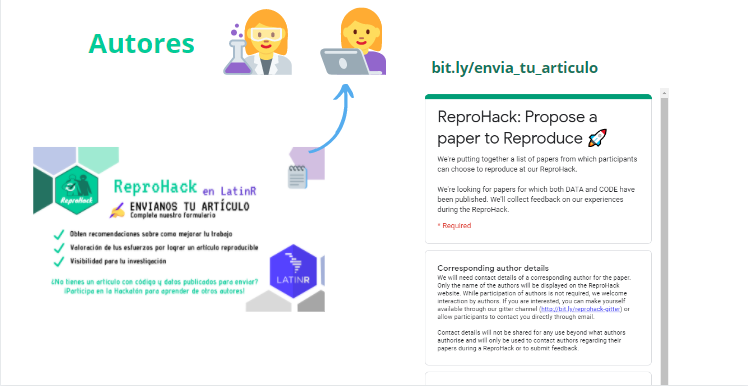
```

---
# ReproHack
```{r 3, echo=FALSE}
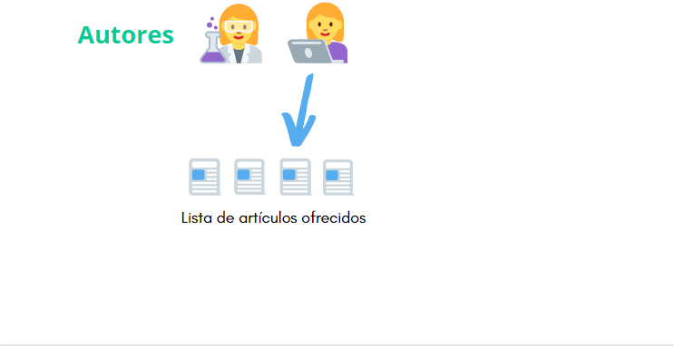
```
---
# ReproHack
```{r 4, echo=FALSE}
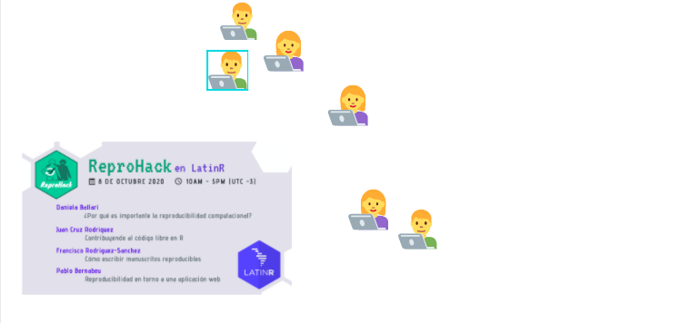
```
---
# ReproHack
```{r 5, echo=FALSE}
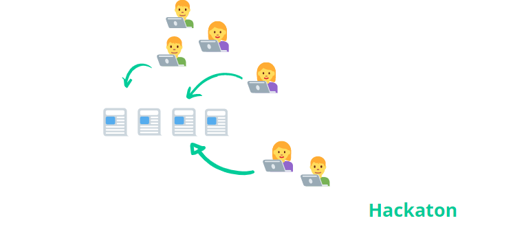
```
---
# ReproHack
```{r 6, echo=FALSE}
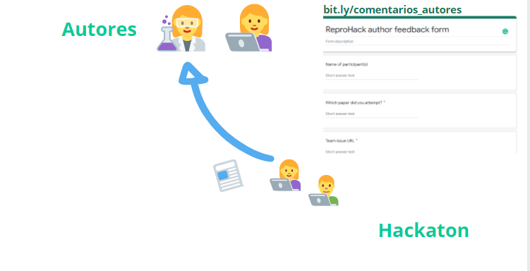
```

---

class: inverse
## Nos comunicamos con `r emo::ji("right_arrow")`  [Etherpad 📝](https://etherpad.wikimedia.org/p/reprohack_latinr2020) 


```{r, echo=FALSE, out.width="90%"}
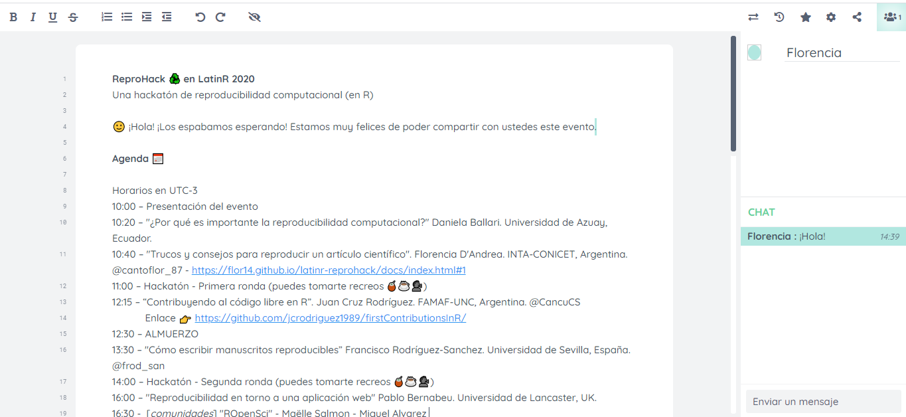
```


---
class: inverse, center, middle

# Agenda

---

### Mañana

**10:00 Bienvenida**
- Plataforma Blackboard Collaborate
- Rompiendo el hielo (Separación en grupos para presentaciones)

**10:20 `r emo::ji("loudspeaker")` Daniela Ballari** ***¿Por qué es importante la reproducibilidad computacional?*** 

--

**10:40 ♻️ Consejos para revisar artículos - Florencia D'Andrea** ***(Charla del equipo de la hackatón)***

**11:00 ReproHack I**
- Revisar la lista, formar grupos, seleccionar trabajos 
- Pausa de café
- Comentario a los autores


**12:00 Nos reagrupamos - una persona de cada grupo nos cuenta su experiencia.**

---

### Mediodía

**12:15 `r emo::ji("loudspeaker")` Juan Cruz Rodríguez -** ***Contribuyendo al código libre en R***

**12:30 PAUSA PARA ALMUERZO**

**13:30 `r emo::ji("loudspeaker")` Francisco Rodríguez-Sánchez -** ***Cómo escribir manuscritos reproducibles***


---

### Tarde

***13:50 ReproHack II***
- Revisar la lista, formar grupos, seleccionar trabajos 
- Pausa para un café `r emo::ji("house")` `r emo::ji("coffee")`
- Comentarios a los autores

**15:45 Nos reagrupamos - una persona de cada grupo nos cuenta su experiencia.**

--

**16:00 `r emo::ji("loudspeaker")` Pablo Bernabeu** ***Reproducibilidad en torno a una aplicación web***

**16:30 `r emo::ji("loudspeaker")` ROpenSci** 

***Revisar paquetes para una mejor ciencia - Maëlle Salmon*** 

***La travesía de taxlist en ROpenSci -  Miguel Alvarez* ***

**16:50 Cierre**

---

class: inverse

# ¿Dónde estamos? 📍

***

## Blackboard Collaborate 

---

## Blackboard Collaborate

```{r, echo=FALSE}
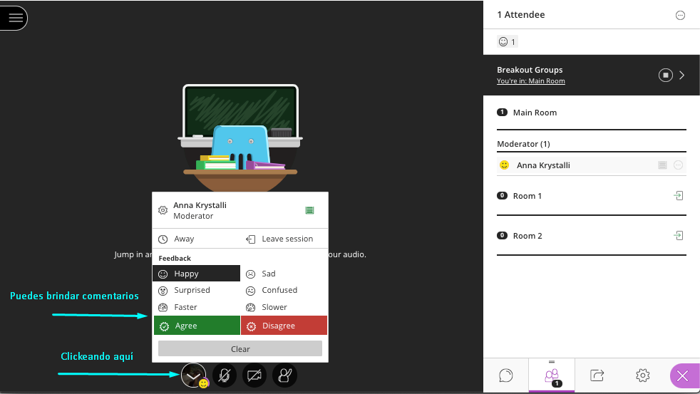
```

---

## Blackboard Collaborate

```{r, echo=FALSE}
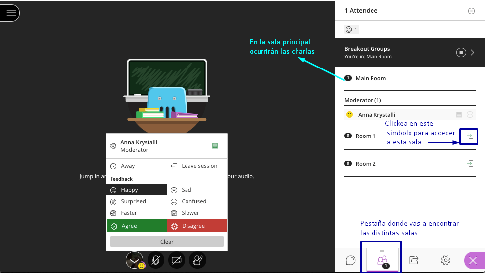
```


---
class: inverse

# Rompiendo el hielo 🧊: Presentaciones

<!-- Use this section as an ice-breaker. Introduce yourself, then allow others to 
go around the room and introduce themselves too -->

---

<!-- Add details about yourself the organiser here: -->

## ¿Quién soy?

> ### Dra. Florencia D'Andrea (@cantoflor_87)
> 
> - Investigadora postdoctoral _INTA-CONICET_
>
> - Chair _LatinR 2020_
>
> - Instructora certificada  _RStudio y The Carpentries_ 
>
> - Parte del equipo global _R-Ladies_


---

## ¿Por qué estoy aquí? 📍

> Traté de dejar mi código disponible y me dí cuenta que hay varias cosas que tener en cuenta que nadie te enseña. 

--

> Trabajar con materiales de otras personas e interactuar con datos y códigos de investigación reales publicados es una buena forma de aprender sobre reproducibilidad.

---

## ¿Quién es mi personaje de ficción preferido?

> Bob Esponja
>
> 


---

# ¡Ahora presentemos al equipo!

### LatinR

**Juliana Benitez**

**Priscila Minotti**

**Roxana Villafañe** 

### ReproHack

**Anna Krystalli**

**David Peréz-Sánchez**

**Daniela Gawehns (twitter)**


---

<!-- Open it up to participants -->
# Tu turno

### En grupos (7 mins)

> - #### ¿Quién sos?

> - #### ¿Por qué estas aquí?

> - #### ¿Cuál es tu personaje de dibujos animado preferido?

--

### Como grupo

> ### ¡Decidan un nombre para su grupo! `r emo::ji("snow-capped mountain")``r emo::ji("camping")``r emo::ji("desert")``r emo::ji("roller_coaster")``r emo::ji("national_park")``r emo::ji("stadium")``r emo::ji("castle")``r emo::ji("Tokyo_tower")``r emo::ji("sunrise")``r emo::ji("desert_island")`


---
class: inverse, center, middle

## `r emo::ji("loudspeaker")` Daniela Ballari 
> ### *¿Por qué es importante la reproducibilidad computacional?*

---
class: inverse

## ¡Qué bueno verlos de vuelta!

***

# Consejos para reproducir un artículo científico 📝

---

## Objetivos de ReproHack 🎯

1. **Experiencia práctica en reproducibilidad**

2. **Comentarios a los autores**

3. **Pensar de manera más amplia en las oportunidades y desafíos**


---


.pull-left[

## Código de conducta

Este evento se encuentra bajo los lineamientos de un código de conducta **Código de conducta ReproHack** [bit.ly/reprohack-coc](https://bit.ly/reprohack-coc)

```{r, echo=FALSE}
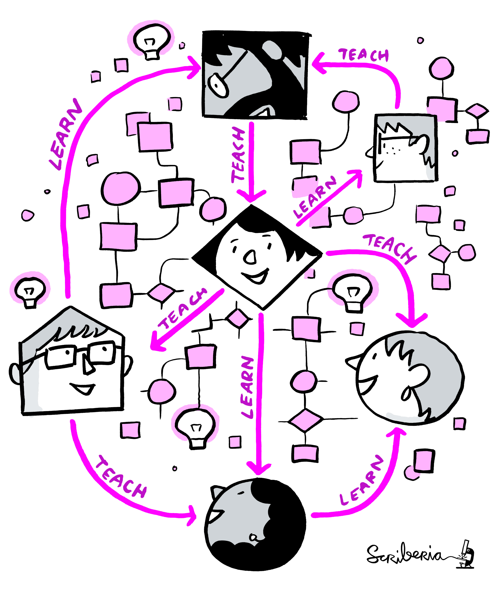
```

]


--
.pull-right[
### Consideraciones adicionales 📝

- #### La reproducibilidad es difícil de alcanzar ¡Los autores que envian sus trabajos son muy valientes! 

### ¡Gracias autores! `r emo::ji("raised_hands")` 
- #### Sin ellos no habría ReproHack. Agradecemos y apreciamos sus esfuerzos. `r emo::ji("pray")` 
- #### Sólo critica constructiva, por favor 

]
---
class: inverse, center, middle

# `r emo::ji("mag")` Revisando y reproduciendo 


```{r, echo=FALSE, out.width="70%"}
knitr::include_graphics("assets/Hackathon.jpg")
```

---

## Eligiendo un artículo ✔️️

.pull-left[
- **Información brindada por los autores:**

  - Lenguajes / herramientas empleadas 
  
  - Te cuentan por qué deberías intentar reproducir su artículo. 
  
- **Número de intentos `r icon::fa('recycle')`** Número de veces que se intentó reproducir el artículo

- **Mean Repro Score `r icon::fa('check-circle')`** Puntaje medio de reproducibilidad (de un máximo de 10) 

    - menor puntaje == ¡más difícil de reproducir!

]


.pull-right[
```{r, echo=FALSE}
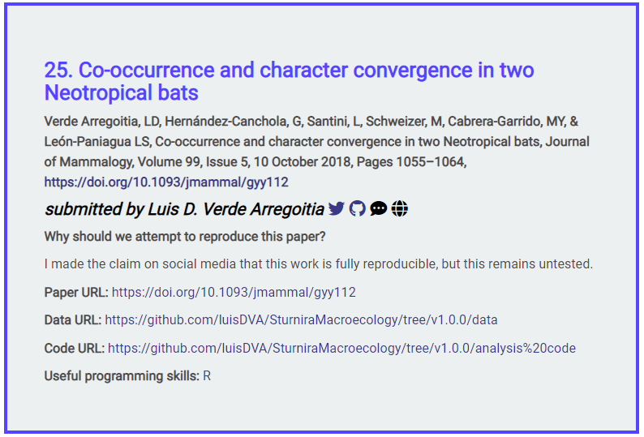
```
]


---

## Eligiendo un artículo

.pull-left[

    
- Registrá que estas trabajando en ese artículo en el EtherPad
   
    ```
    **Artículo**: <Título>
        *Revisores*: Revisor 1, etc.
    ```
    
]


.pull-right[
```{r, echo=FALSE}
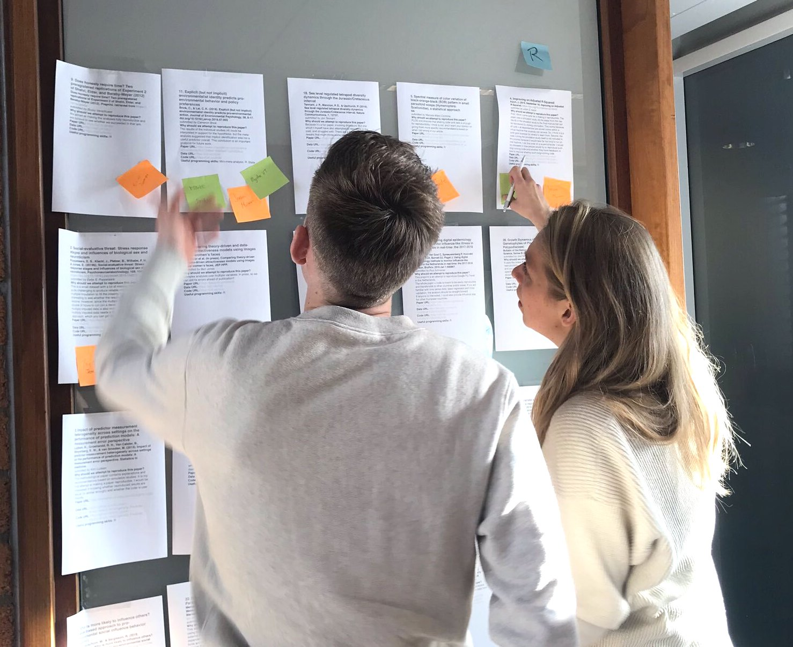
```
]

---
class: inverse, center, middle

# Revisa como un auditor `r emo::ji("bookmark_tabs")`


--

#### **¡Tan poco tan así 🧐!**

```{r, echo=FALSE, out.width="60%"}
knitr::include_graphics("https://www.reactiongifs.com/r/O_o.gif")
```


---
class: centers

# `r emo::ji("mag")` Para materiales sobre FAIR

```{r, echo=FALSE, out.width="80%"}
knitr::include_graphics("assets/FAIRPrinciples.jpg")
```

---

## Principios FAIR (en español)

- #### Localizables

- #### Accesibles

- #### Interoperables

- #### Reutilizables

---

.pull-left[

# Accesibilidad 

- ¿Cuán **fácil** fue **acceder** a los materiales?

- ¿Pudiste descargarte todos los archivos que necesitabas?

]

--

.pull-right[

# Instalación 

- ¿Cuán **fácil / automática** fue la **instalación**?

- ¿Tuviste algun problema?

- ¿Cómo lo resolviste?
]

---

.pull-left[


# Datos 

- ¿Estaban los **datos claramente separados del código y otros items**?

- ¿Encontraron **grandes archivos de datos almacenados en un repositorio confiable** y referidos usando un **identificador persistente**?

- ¿Estaban los **datos documentados** de alguna forma?

]

--

.pull-right[

# Documentación 

¿Había **suficiente documentación** describiendo:
- ¿Cómo **instalar** el software necesario incluyendo dependencias no-estándar?

- ¿Cómo **usar** materiales para reproducir el paper?

- ¿Cómo **citar** los materiales, idealmente en un formato que pueda ser copiado y pegado?

]

---

.pull-left[

# Análisis 

- **¿Te fue posible reproducir completamente** el artículo? `r emo::ji("white_check_mark")`

- **¿Cuán automatizado fue** el proceso de reproducir el artículo?

- **Qué fácil fue vincular** el código **del análisis** a:
   - los **gráficos** que genera
   - **secciones del manuscrito** en las que se describe y se informan los resultados
]
--

.pull-right[

### Si el análisis no fue completamente reproducible `r emo::ji("no_entry_sign")` 😑

 - **¿Faltaban dependencias?**
 
 - ¿No estaba el **entorno computacional no adecuadamente descripto** / capturado?
 
 - ¿Había **bugs** en el código? 🐛
 
 -  ¿Se ejecutó **código pero los resultados (por ejemplo, salidas de modelos, tablas, figuras) difieren** de los publicados? ¿Por cuánto? 
]

---
class: inverse, center, middle

# Revisa como un usuario/a`r emo::ji("video_game")`

--

.pull-left[

### Nuevo usuario/a

```{r, echo=FALSE, out.width="80%"}
knitr::include_graphics("https://25.media.tumblr.com/30906cccedfe97a3d5450a23359ca298/tumblr_ml72i2eL6t1rsudnqo1_500.gif")
```


]

--

.pull-right[

### Usuario con experiencia

```{r, echo=FALSE, out.width="80%"}
knitr::include_graphics("https://media.giphy.com/media/9K2nFglCAQClO/source.gif")
```


]


---
## Revisa como un usuario/a `r emo::ji("video_game")`

#### ¿Qué te pareció fácil/intuitivo? 

> ¿La estructura y el nombre de los archivos fueron informativos / intuitivos?

> ¿Fue fácil seguir el flujo de trabajo del análisis?

> ¿Faltaba documentación o era confusa?


#### ¿Qué te pareció confuso/difícil?
> Identificar puntos de presión. ¿Sugerencias constructivas?


#### ¿Qué te gustó?
> Identifique los aspectos que funcionaron bien.

---
class: inverse, center, middle

# Comentarios

# `r emo::ji("speech_balloon")`

---


## Comentarios como miembro de la comunidad

.pull-left[

#### Reconocer el esfuerzo del autor 

#### Envía comentarios constructivos

#### Enfocate en los beneficios para la comunidad

```{r, echo=FALSE, out.width="80%"}
knitr::include_graphics("assets/1728_TURI_Book sprint_11 community_040619.jpg")
```

]
.pull-right[

> #### Ayuda a crear una convención sobre lo que debería ser un Compendio de Investigación (_research compendium_) y cómo deberíamos poder utilizarlo

```{r, echo=FALSE, out.width="80%"}
knitr::include_graphics("assets/ResearchCompendium.jpg")
```

]

---
class: inverse, center, middle

# Actividades adicionales ➕

---

## ¿Terminaste temprano? ⏲️

### Explora el trabajo más profundamente:

- Intente realizar análisis adicionales.

- Crear nuevas parcelas.

- ¡Combine materiales con los suyos propios o con otros materiales abiertos disponibles en la web!

---


### Pautas de participación 🤝

--

#### Compartiendo nuestra experiencia en la sala principal durante las 📢 charlas o momentos de reagrupamiento 

- Por favor, permanece en silencio hasta que se le invite a hablar.
- Agrega preguntas para los oradores en el Etherpad. 

--

#### Durante el los momentos de hackatón 🙌
- Te animamos a participar tanto como sea posible.
- No dudes en silenciar, apagar la cámara y desconectar si es necesario.

--

- Siéntete libre de moverte e ir a saludar o ayudar en otros grupos 👋.

- Fomentamos las discusiones en las salas. Tenga en cuenta que los demás intentan trabajar 👉 La **sala principal** y la **cafetería** siempre están disponibles para pasar el rato.

---


### Pautas de participación 🙌

### En cualquier momento
- Siéntase libre de agregar **notas colaborativas** en el Etherpad ✍️
- Contacte a cualquier persona del equipo de la hackatón en el chat

---
class: inverse

## ¡Empecemos! `r emo::ji("checkered_flag")`

### 11:00 - 11:15

#### `r emo::ji("mag_right")` Lista de artículos

✅  Elige un artículo de nuestra lista

#### `r emo::ji("busts_in_silhouette")` Formación de equipos / registro de proyectos

✅  Esta bien trabajar individualmente

✅  Registra tu equipo y escribe en el [** Etherpad: bit.ly/reprohack_latinr2020**](https://etherpad.wikimedia.org/p/reprohack_latinr2020).

### `r emo::ji("house")``r emo::ji("coffee")`¡Toma un descanso!

---
class: inverse

## 11:00 - 12:00 `r emo::ji("computer")` ReproHack I 
### (salas / break-out rooms) 

👉 Puedes elegir una sala y trabajar en grupo. 

👉 Buscar ayuda en el chat principal. 

👉 Siéntase libre de cambiar de grupo o pasar el rato en la **sala principal** o **cafetería**

### Antes de la hora del almuerzo nos reencontramos `r emo::ji("+1")`
#### Resumimos experiencias grupales


---
class: inverse

## 12:00 - 12:15 `r emo::ji("speech_balloon")` Nos reagrupamos en la sala principal 

***

### Comentarios de experiencias 🎤

---

class: inverse, center, middle

## `r emo::ji("loudspeaker")` Juan Cruz Rodríguez  

> ### *Contribuyendo al código libre en R*


---
class: inverse

## 12:30 - 13:30 `r emo::ji("green_salad")``r emo::ji("burrito")` ALMUERZO

Siéntase libre de desconectar o pasar el rato en la *sala principal* o *café.*

### Vuelve para la segunda charla a las 13:30 hs UTC-3


---

class: inverse, center, middle

## `r emo::ji("loudspeaker")` Francisco Rodríguez-Sánchez  
> ### *Cómo escribir manuscritos reproducibles*


---
class: inverse

## 13:50 - 16:00  `r emo::ji("computer")` ReproHack II 
### (salas / break-out rooms) 

👉 Puedes elegir una sala y trabajar en grupo. 

👉 Buscar ayuda en el chat principal. `r emo::ji("house")``r emo::ji("coffee")` 

👉 Siéntase libre de cambiar de grupo o pasar el rato en la **sala principal** o **cafetería**

### Antes del reagrupamiento final `r emo::ji("+1")`
#### Completa el formulario de comentarios del autor `r emo::ji("writing_hand")`
- ¿Cómo les fue con su/s artículo/s? Resumir experiencias en el Etherpad

---

class: inverse

## 15:45 - 16:00 Reagrupamiento final `r emo::ji("speech_balloon")`

- #### ¿Cómo les fue a los grupos?

- #### Comentarios finales.

- #### Etherpad 
   + Una cosa que te gustó
   + Una cosa que se puede mejorar.

---

class: inverse, center, middle

## `r emo::ji("loudspeaker")` Pablo Bernabeu


> ### *Reproducibilidad entorno a una aplicación web*

---

class: center, middle

# Comunidad: ROpenSci

```{r ropen, echo= FALSE}
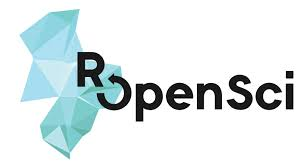
```


---

class: inverse, center, middle


## 🎥 Maëlle Salmon  

## Revisar paquetes para una mejor ciencia 


---

class: inverse, center, middle

## 🎥 Miguel Alvarez  

## La travesía de `taxlist` en ROpenSci  


---

class: inverse, center, middle

## Preguntas
#### Anna Krystalli


---
class: inverse, center, middle

# Palabras de cierre


---
class: inverse, center, middle

# Recursos ✨

---

## Recursos (en inglés)

- [** The Turing Way **](https://the-turing-way.netlify.com/introduction/introduction): una guía ligeramente obstinada sobre ciencia de datos reproducible.

- [**Análisis estadísticos e investigación reproducible**](): Introducción de Gentleman y Temple Lang del concepto de Compendio de investigación

- [**Empaquetar el trabajo analítico de datos de forma reproducible usando R (y amigos)**](https://peerj.com/preprints/3192/): cómo los investigadores pueden mejorar la reproducibilidad de su trabajo utilizando compendios de investigación basados ​​en paquetes R y herramientas relacionadas

---
## Recursos (en inglés)

- [Cómo leer un compendio de investigación](https://arxiv.org/pdf/1806.09525.pdf): Introducción a las convenciones existentes para los compendios de investigación y sugerencias sobre cómo utilizar sus propiedades compartidas en un proceso de lectura estructurado.

- [Investigación reproducible en R con `rrtools`](https://annakrystalli.me/rrtools-repro-research/): Taller: Crear un compendio de investigación en torno a materiales asociados con un artículo publicado (texto, datos y código) utilizando `rrtools` .
  - [**Compendio de ejemplo**](https://github.com/annakrystalli/rrcompendiumDTB): compendio de Demo Research.

---

## ¿Disfrutaste la hackatón? 💯

### ¡Involucrate! 🙌


#### [reprohack / reprohack-hq](https://github.com/reprohack/reprohack-hq) repositorio de GH

#### Consulta nuestros [issues](https://github.com/reprohack/reprohack-hq/issues)


#### Chatea con nosotros:

[Slack](https://reprohack-autoinvite.herokuapp.com/)


#### ¡Organiza tu propio evento! 😊
#### ¡Envía tus propios artículos! 📝

---

class: inverse, middle, center

## ¡Muchas formas de participar en ReproHack!


```{r, echo=FALSE, out.width="80%"}
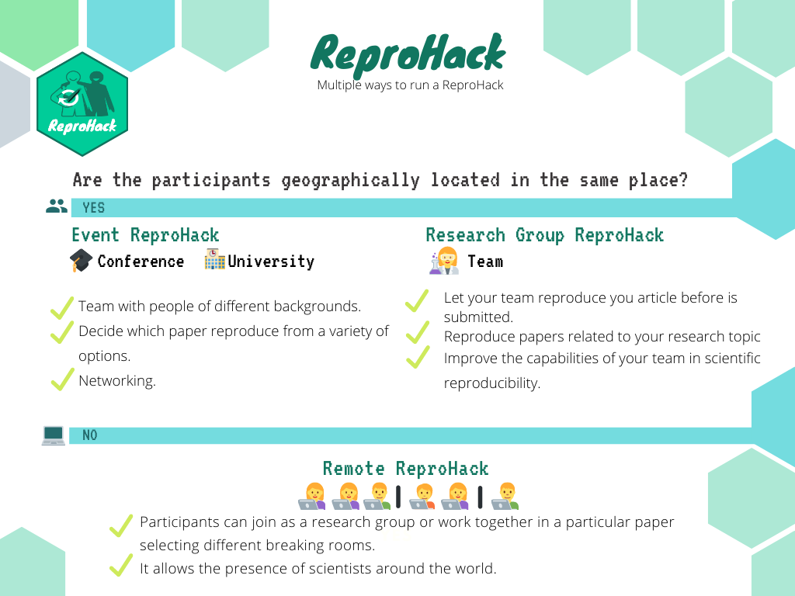
```


---

# ¡Muchas gracias! `r emo::ji("pray")`

- #### ¡Gracias PARTICIPANTES por venir!
- #### ¡Gracias AUTORES por enviarnos sus artículos!
- #### ¡Gracias al grupo de RSE de Sheffield y a The software Sustainability Institute por patrocinar ReproHack!


# `r emo::ji("wave")`

---
class: inverse

# Agradecimientos

Las imágenes en todas las diapositivas marcadas con **Scriberia** fueron creadas por [Scriberia] (https://www.scriberia.co.uk/) para la comunidad de The Turing Way y se utilizan bajo una licencia CC-BY
- _La comunidad de Turing Way y Scriberia. (2019, 11 de julio). Ilustraciones del libro Turing Way. Zenodo. http://doi.org/10.5281/zenodo.3332808_